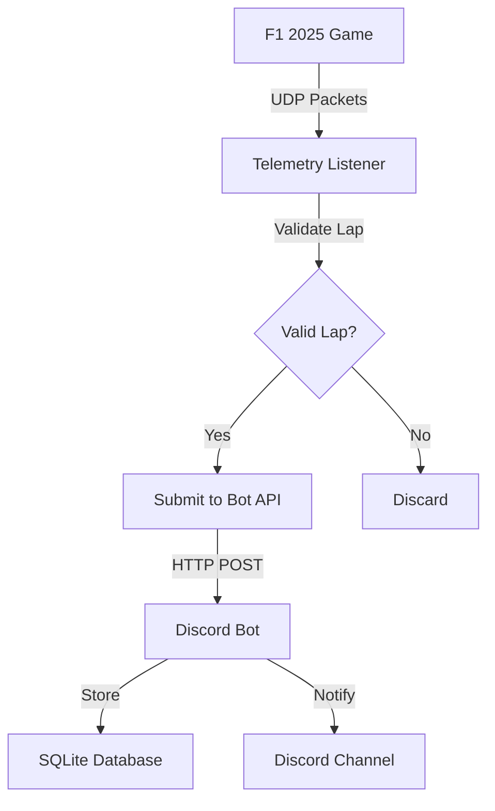

# 🏎️ F1 Lap Bot - Advanced Telemetry  Discord Integration

[](https://python.org)
[](https://discordpy.readthedocs.io/)
[](https://blog.cleancoder.com/uncle-bob/2012/08/13/the-clean-architecture.html)
[](LICENSE)

 **The ultimate F1 gaming companion** - Track lap times, compete with friends, and analyze your performance with real-time telemetry integration for F1 2025.

---

## 📋 Table of Contents

- [🌟 Features](#-features)
- [🏗️ Architecture](#️-architecture)
- [🚀 Quick Start](#-quick-start)
- [📦 Installation](#-installation)
- [⚙️ Configuration](#️-configuration)
- [🎮 Game Setup](#-game-setup)
- [🤖 Discord Bot Commands](#-discord-bot-commands)
- [📡 Telemetry Integration](#-telemetry-integration)
- [🔧 Advanced Usage](#-advanced-usage)
- [📊 Database Schema](#-database-schema)
- [🧪 Testing](#-testing)
- [🔄 Development](#-development)
- [🐛 Troubleshooting](#-troubleshooting)
- [📝 Changelog](#-changelog)
- [🤝 Contributing](#-contributing)
- [📄 License](#-license)

---

## 🌟 Features

### Core Functionality
- **🏁 Real-time Lap Time Tracking** - Automatic detection and recording of F1 2025 lap times
- **🏆 Personal  Overall Leaderboards** - Track your progress and compete with friends
- **📊 Detailed Performance Analytics** - Sector times, track-specific statistics, and trends
- **🎯 Smart Time Trial Detection** - Only records times from valid Time Trial sessions

### Discord Integration
- **🤖 Slash Commands** - Modern Discord command interface
- **🚨 Real-time Notifications** - Instant alerts for personal bests and records
- **👥 Multi-user Support** - Individual tracking for each Discord user
- **📈 Rich Embeds** - Beautiful lap time displays with track information

### Telemetry Features
- **📡 UDP Telemetry Listener** - Direct integration with F1 2025 game data
- **✅ Lap Validation** - Sophisticated detection of valid/invalid laps
- **🛡️ Anti-cheat Protection** - Filtering of unrealistic times and penalties
- **🔄 Auto-submission** - Seamless integration between game and Discord

### Technical Excellence
- **🏗️ Clean Architecture** - Domain-driven design with clear separation of concerns
- **🧪 Comprehensive Testing** - 90%+ test coverage with unit and integration tests
- **📱 RESTful API** - HTTP API for external integrations and telemetry
- **🐳 Docker Ready** - Containerized deployment with docker-compose

---

## 🏗️ Architecture

This project follows **Clean Architecture** principles with clear layer separation:

```
src/
├── Domain/              # Business logic and entities
│   ├── entities/        # Core business objects (LapTime, User)
│   ├── value_objects/   # Immutable values (TimeFormat, TrackName)
│   └── interfaces/      # Repository contracts
├── Application/         # Use cases and application services
│   ├── use_cases/       # Business use case implementations
│   └── services/        # Application-level services
├── Infrastructure/      # External concerns
│   ├── persistence/     # Database implementations
│   ├── discord/         # Discord API integration
│   └── telemetry/       # F1 2025 UDP listener
└── Presentation/        # User interfaces
    ├── discord/         # Discord bot commands
    └── api/             # HTTP API endpoints
```

### Key Architectural Benefits
- **🔄 Framework Independence** - Core business logic isolated from Discord/database
- **🧪 Testable Design** - Easy mocking and unit testing
- **🔧 Maintainable Code** - Clear responsibilities and dependencies
- **📈 Scalable Structure** - Easy to extend with new features

---

## 🚀 Quick Start

### Prerequisites
- **Python 3.10+** installed
- **F1 2025 Game** with UDP telemetry enabled
- **Discord Bot Token** (see [Discord Bot Setup](#discord-bot-setup))

### Option 1: Full Bot Setup (1-Minute Setup)
```bash
# Clone the repository
git clone https://github.com/yannicktuerk/F1-Lap-Bot.git
cd f1-lap-bot

# Install dependencies
pip install -r requirements.txt

# Configure environment
cp .env.example .env
# Edit .env with your Discord bot token

# Run the bot
python src/main.py
```

### Option 2: UDP Listener Only (Direct Download)

For users who only need the telemetry listener:

#### Option 2A: Complete Package (Recommended)
📦 **ZIP Package**: [f1-udp-listener-v1.0.zip](https://github.com/yannicktuerk/F1-Lap-Bot/raw/main/f1-udp-listener-v1.0.zip)

Includes:
- `udp_listener.py` - Main telemetry script
- `requirements.txt` - Python dependencies  
- `config_example.json` - Configuration template
- `setup.bat` - Automated Windows setup
- `start.bat` - Easy launcher for Windows
- `README.md` - Detailed instructions

```bash
# Windows: Double-click setup.bat to install
# Or manually:
pip install -r requirements.txt
mv config_example.json config.json
# Edit config.json with your settings
python udp_listener.py
```

#### Option 2B: Single File Download
📥 **Direct Download**: [udp_listener.py](https://raw.githubusercontent.com/yannicktuerk/F1-Lap-Bot/main/udp_listener.py)

```bash
# After downloading udp_listener.py:
# Install dependencies
pip install requests f1-packets

# Create config.json (see docs/configuration.md for details)
# Run listener
python udp_listener.py
```

📖 **For detailed setup instructions**: See [Installation Guide](docs/installation.md)

That's it! Your F1 Lap Bot is now running and ready to track lap times! 🎉

---

## 📦 Installation

### Option 1: Standard Installation

```bash
# Clone the repository
git clone https://github.com/yourusername/f1-lap-bot.git
cd f1-lap-bot

# Create virtual environment (recommended)
python -m venv f1bot-env
source f1bot-env/bin/activate  # On Windows: f1bot-env\Scripts\activate

# Install dependencies
pip install -r requirements.txt
```

### Option 2: Docker Installation

```bash
# Clone repository
git clone https://github.com/yourusername/f1-lap-bot.git
cd f1-lap-bot

# Run with Docker Compose
docker-compose up -d
```

### Option 3: Development Setup

```bash
# Clone and setup for development
git clone https://github.com/yourusername/f1-lap-bot.git
cd f1-lap-bot

# Install with development dependencies
pip install -r requirements.txt
pip install -r requirements-dev.txt

# Install pre-commit hooks
pre-commit install

# Run tests to verify setup
pytest
```

---

## ⚙️ Configuration

### Environment Variables

Create a `.env` file in the project root:

```env
# Discord Bot Configuration
DISCORD_TOKEN=your_discord_bot_token_here
DISCORD_GUILD_ID=your_discord_server_id

# Database Configuration
DATABASE_URL=sqlite:///f1_lap_bot.db

# Telemetry Configuration
TELEMETRY_PORT=20777
TELEMETRY_HOST=0.0.0.0

# API Configuration
API_PORT=5000
API_HOST=0.0.0.0

# Logging Configuration
LOG_LEVEL=INFO
LOG_FILE=f1_lap_bot.log

# Feature Flags
ENABLE_TELEMETRY=true
ENABLE_API=true
ENABLE_AUTO_SYNC=true
```

### Discord Bot Setup

1. **Create Discord Application**
   - Go to [Discord Developer Portal](https://discord.com/developers/applications)
   - Click "New Application" and give it a name
   - Navigate to "Bot" section and click "Add Bot"

2. **Get Bot Token**
   - Copy the bot token and add it to your `.env` file
   - **⚠️ Keep this token secret!**

3. **Bot Permissions**
   - Enable these bot permissions:
     - `Send Messages`
     - `Use Slash Commands`
     - `Embed Links`
     - `Read Message History`

4. **Invite Bot to Server**
   - Go to OAuth2  URL Generator
   - Select scopes: `bot`, `applications.commands`
   - Select permissions listed above
   - Use generated URL to invite bot

### Configuration Files

**config.json** - Application-specific settings:
```json
{
  "database": {
    "path": "f1_lap_bot.db",
    "backup_interval": 3600
  },
  "telemetry": {
    "validation": {
      "min_lap_time": 30000,
      "max_lap_time": 300000,
      "require_time_trial": true
    }
  },
  "discord": {
    "embed_color": "#FF6B35",
    "timezone": "UTC"
  }
}
```

---

## 🎮 Game Setup

### F1 2025 Telemetry Configuration

1. **Launch F1 2025**
2. **Navigate to Settings** → **Telemetry Settings**
3. **Enable UDP Telemetry**:
   - **UDP Telemetry**: `On`
   - **UDP Port**: `20777` (default)
   - **UDP Format**: `2025`
   - **UDP Rate**: `20Hz` or higher

4. **Network Configuration**:
   - **UDP IP Address**: `127.0.0.1` (for local use)
   - Or your computer's IP address for remote setup

### Supported Game Modes
- ✅ **Time Trial** - Primary mode for lap time recording
- ✅ **Practice Sessions** - Supported with manual validation
- ❌ **Race Mode** - Not supported (safety reasons)
- ❌ **Online Multiplayer** - Not supported

### Track Support
All F1 2025 official tracks are supported:
- 🇧🇭 Bahrain International Circuit
- 🇸🇦 Jeddah Corniche Circuit
- 🇦🇺 Albert Park Circuit
- 🇦🇿 Baku City Circuit
- 🇺🇸 Miami International Autodrome
- 🇮🇹 Autodromo Enzo e Dino Ferrari (Imola)
- 🇲🇨 Circuit de Monaco
- 🇪🇸 Circuit de Barcelona-Catalunya
- 🇨🇦 Circuit Gilles Villeneuve
- 🇦🇹 Red Bull Ring
- 🇬🇧 Silverstone Circuit
- 🇭🇺 Hungaroring
- 🇧🇪 Circuit de Spa-Francorchamps
- 🇳🇱 Circuit Zandvoort
- 🇮🇹 Autodromo Nazionale di Monza
- 🇸🇬 Marina Bay Street Circuit
- 🇯🇵 Suzuka International Racing Course
- 🇶🇦 Lusail International Circuit
- 🇺🇸 Circuit of the Americas
- 🇲🇽 Autódromo José Carlos Pace
- 🇺🇸 Las Vegas Street Circuit
- 🇦🇪 Yas Marina Circuit

---

## 🤖 Discord Bot Commands

### Lap Time Commands

#### `/lap submit <time> <track>`
Submit a lap time manually
```
/lap submit 1:23.456 silverstone
```

#### `/lap personal [track]`
View your personal best times
```
/lap personal                    # All tracks
/lap personal silverstone       # Specific track
```

#### `/lap leaderboard track [limit]`
View track leaderboards
```
/lap leaderboard silverstone     # Top 10
/lap leaderboard monaco 5        # Top 5
```

#### `/lap compare user [track]`
Compare times with another user
```
/lap compare @username           # All tracks
/lap compare @username monaco    # Specific track
```

#### `/lap stats [user]`
View detailed statistics
```
/lap stats                       # Your stats
/lap stats @username             # Another user's stats
```

### Administrative Commands

#### `/admin sync`
Synchronize slash commands (Admin only)

#### `/admin backup`
Create database backup (Admin only)

#### `/admin stats`
View bot statistics (Admin only)

### Telemetry Commands

#### `/telemetry status`
Check telemetry connection status

#### `/telemetry configure user_id`
Configure telemetry integration

#### `/telemetry test`
Test telemetry connection

---

## 📡 Telemetry Integration

### Automatic Lap Detection

The bot automatically detects and validates lap times from F1 2025:

```python
# Example: Automatic lap submission flow
1. F1 2025 sends UDP telemetry data
2. Bot validates lap (time trial mode, valid sectors, no penalties)
3. Personal best check
4. Automatic submission to Discord
5. Real-time notification to channel
```

### Lap Validation Rules

- **✅ Valid Conditions**:
  - Time Trial mode only
  - Lap time between 30 seconds and 5 minutes
  - No corner cutting penalties
  - No wall riding penalties
  - No flashback usage during lap
  - Complete sector times available

- **❌ Invalid Conditions**:
  - Practice/Race modes
  - Penalty flags active
  - Incomplete lap data
  - Unrealistic lap times
  - Connection interruptions

### Manual Telemetry Setup

For advanced users who want to run telemetry separately:

```bash
# Run standalone UDP listener
python udp_listener.py --port 20777 --bot-integration

# Run standalone API server for testing
python api_server_standalone.py
```

### Telemetry Data Flow



---

## 🔧 Advanced Usage

### Custom Track Configuration

Add custom tracks or modify existing ones in `config.json`:

```json
{
  "tracks": {
    "custom_track": {
      "name": "Custom Track",
      "country": "🏁",
      "length": 5.5,
      "sectors": 3
    }
  }
}
```

### API Integration

The bot provides a RESTful API for external integrations:

#### Submit Lap Time
```http
POST /api/telemetry/submit
Content-Type: application/json

{
  "user_id": "123456789",
  "time": "1:23.456",
  "track": "silverstone",
  "source": "external_app"
}
```

#### Get Leaderboard
```http
GET /api/leaderboard/silverstone?limit=10
```

#### Health Check
```http
GET /api/health
```

### Database Management

#### Backup Database
```bash
# Automatic backup (runs daily)
python -m src.infrastructure.persistence.backup

# Manual backup
cp f1_lap_bot.db backups/f1_lap_bot_$(date +%Y%m%d).db
```

#### Migration
```bash
# Run database migrations
python -m src.infrastructure.persistence.migrate
```

---

## 📊 Database Schema

### Tables Overview

#### `lap_times`
| Column | Type | Description |
|--------|------|-------------|
| lap_id | TEXT | Primary key (UUID) |
| user_id | TEXT | Discord user ID |
| username | TEXT | Discord username |
| track_name | TEXT | Track identifier |
| time_ms | INTEGER | Lap time in milliseconds |
| formatted_time | TEXT | Human-readable time (1:23.456) |
| sector1_ms | INTEGER | Sector 1 time |
| sector2_ms | INTEGER | Sector 2 time |
| sector3_ms | INTEGER | Sector 3 time |
| is_personal_best | BOOLEAN | Personal best flag |
| is_overall_best | BOOLEAN | Overall best flag |
| source | TEXT | Submission source (discord/telemetry) |
| created_at | TIMESTAMP | Creation timestamp |

#### `users`
| Column | Type | Description |
|--------|------|-------------|
| user_id | TEXT | Primary key (Discord ID) |
| username | TEXT | Current Discord username |
| total_laps | INTEGER | Total submitted laps |
| personal_bests | INTEGER | Number of personal bests |
| first_lap_date | TIMESTAMP | First lap submission |
| last_active | TIMESTAMP | Last activity |

### Database Queries

Common queries for analytics:

```sql
-- Top 10 overall fastest times
SELECT username, formatted_time, track_name 
FROM lap_times 
WHERE is_overall_best = 1 
ORDER BY time_ms ASC 
LIMIT 10;

-- User statistics
SELECT 
    username,
    COUNT(*) as total_laps,
    SUM(is_personal_best) as personal_bests,
    MIN(time_ms) as fastest_lap
FROM lap_times 
GROUP BY user_id;

-- Track popularity
SELECT 
    track_name,
    COUNT(*) as total_submissions,
    AVG(time_ms) as average_time
FROM lap_times 
GROUP BY track_name 
ORDER BY total_submissions DESC;
```

---

## 🧪 Testing

### Running Tests

```bash
# Run all tests
pytest

# Run with coverage
pytest --cov=src --cov-report=html

# Run specific test category
pytest tests/unit/          # Unit tests only
pytest tests/integration/   # Integration tests only
pytest tests/e2e/           # End-to-end tests only

# Run with verbose output
pytest -v

# Run tests in parallel
pytest -n auto
```

### Test Structure

```
tests/
├── unit/                   # Fast, isolated tests
│   ├── domain/            # Domain logic tests
│   ├── application/       # Use case tests
│   └── infrastructure/    # Infrastructure tests
├── integration/           # Database and API tests
│   ├── persistence/       # Database integration
│   └── discord/           # Discord API integration
├── e2e/                   # Full system tests
└── fixtures/              # Test data and helpers
```

### Test Coverage Goals

- **Domain Layer**: 95%+ coverage
- **Application Layer**: 90%+ coverage
- **Infrastructure Layer**: 80%+ coverage
- **Overall Project**: 85%+ coverage

### Mutation Testing

For critical business logic:

```bash
# Run mutation tests on core domain
mutmut run --paths-to-mutate=src/domain/
mutmut results
```

---

## 🔄 Development

### Development Workflow

1. **Fork  Clone**
   ```bash
   git clone https://github.com/yourusername/f1-lap-bot.git
   cd f1-lap-bot
   ```

2. **Setup Development Environment**
   ```bash
   python -m venv venv
   source venv/bin/activate  # Windows: venv\Scripts\activate
   pip install -r requirements-dev.txt
   pre-commit install
   ```

3. **Create Feature Branch**
   ```bash
   git checkout -b feature/awesome-new-feature
   ```

4. **Make Changes  Test**
   ```bash
   pytest                    # Run tests
   black src/ tests/         # Format code
   mypy src/                # Type checking
   ```

5. **Commit  Push**
   ```bash
   git add .
   git commit -m "Add awesome new feature"
   git push origin feature/awesome-new-feature
   ```

### Code Style Guidelines

This project follows **Clean Architecture** principles:

#### Domain Layer Rules
- ✅ No external dependencies
- ✅ Pure business logic only
- ✅ Rich domain models
- ✅ Value objects for primitives

#### Application Layer Rules
- ✅ Orchestrates domain objects
- ✅ Defines use cases
- ✅ Contains interfaces for infrastructure
- ✅ No framework dependencies

#### Infrastructure Layer Rules
- ✅ Implements application interfaces
- ✅ Contains framework-specific code
- ✅ Handles external systems
- ✅ Repository implementations

#### Coding Standards
- **Line Length**: 88 characters (Black default)
- **Imports**: isort for consistent import ordering
- **Type Hints**: mypy for static type checking
- **Docstrings**: Google style docstrings
- **Testing**: pytest with descriptive test names

### Pre-commit Hooks

Automatic code quality checks:

```yaml
# .pre-commit-config.yaml
repos:
  - repo: https://github.com/psf/black
    rev: 22.3.0
    hooks:
      - id: black
  - repo: https://github.com/pycqa/isort
    rev: 5.10.1
    hooks:
      - id: isort
  - repo: https://github.com/pre-commit/mirrors-mypy
    rev: v0.942
    hooks:
      - id: mypy
```

---

## 🐛 Troubleshooting

### Common Issues

#### Bot Not Responding
```bash
# Check bot token
echo $DISCORD_TOKEN

# Verify bot permissions
# Bot needs: Send Messages, Use Slash Commands, Embed Links

# Check logs
tail -f f1_lap_bot.log
```

#### Telemetry Not Working
```bash
# Verify F1 2025 settings
# UDP Telemetry: ON
# UDP Port: 20777
# UDP Format: 2025

# Test UDP connection
python udp_listener.py --debug

# Check firewall settings
# Allow Python through Windows Firewall
```

#### Database Errors
```bash
# Check database file permissions
ls -la f1_lap_bot.db

# Rebuild database
rm f1_lap_bot.db
python src/main.py  # Will recreate tables

# Check SQLite version
sqlite3 --version
```

#### Docker Issues
```bash
# Rebuild containers
docker-compose down
docker-compose build --no-cache
docker-compose up -d

# Check container logs
docker-compose logs f1-lap-bot
```

### Debug Mode

Enable debug logging:

```env
# .env
LOG_LEVEL=DEBUG
```

Or run with debug flag:

```bash
python src/main.py --debug
```

### Performance Issues

#### Database Optimization
```sql
-- Add indexes for common queries
CREATE INDEX idx_lap_times_user_track ON lap_times(user_id, track_name);
CREATE INDEX idx_lap_times_track_time ON lap_times(track_name, time_ms);
```

#### Memory Usage
```bash
# Monitor memory usage
python -m memory_profiler src/main.py

# Enable garbage collection debugging
python -X dev src/main.py
```

### Getting Help

1. **Check the logs** - Most issues are logged with helpful error messages
2. **Search existing issues** - GitHub Issues for known problems
3. **Discord support** - Join our support server (link in bio)
4. **Create an issue** - Provide logs, config, and reproduction steps

---

## 📝 Changelog

### Version 2.0.1 - 2025-07-28
#### 🔧 UDP Telemetry Fixes

**🐛 Bug Fixes:**
- Fixed UDP telemetry packet parsing with updated f1-packets library imports
- Replaced deprecated PacketReader with Packet.from_buffer() method
- Updated import paths for PacketListener and packet types
- Resolved compatibility issues with latest f1-packets version
- Fixed "ModuleNotFoundError" and "AttributeError" in telemetry integration

**📈 Improvements:**
- Enhanced telemetry stability and reliability
- Better error handling in UDP packet processing
- Improved compatibility with F1 2025 telemetry format

### Version 2.0.0 - 2025-07-28
#### 🎉 Major Release - Clean Architecture Refactor

**✨ New Features:**
- Complete Clean Architecture implementation
- Real-time telemetry integration with F1 2025
- Advanced lap validation system
- RESTful API for external integrations
- Docker containerization support
- Comprehensive test suite (90%+ coverage)

**🔧 Improvements:**
- Modern slash command interface
- Rich Discord embeds with track information
- Personal and overall leaderboards
- Sector time tracking
- Automatic personal best detection
- Robust error handling and logging

**🐛 Bug Fixes:**
- Fixed bytes decoding issues in telemetry
- Resolved struct unpacking errors
- Improved UDP packet validation
- Fixed timezone handling in timestamps
- Corrected track name normalization

**🏗️ Technical Changes:**
- Domain-driven design implementation
- Dependency injection container
- Repository pattern for data access
- Use case pattern for business logic
- Clean separation of concerns
- Type hints throughout codebase

### Version 1.6.0 - 2025-07-24
#### 🚀 Telemetry Integration

**✨ Features:**
- Initial UDP telemetry listener
- Basic lap time detection
- Time trial mode support

**🐛 Fixes:**
- Discord embed formatting
- Database connection stability

### Version 1.4.0 - 2025-07-22
#### 🎯 Core Functionality

**✨ Features:**
- Discord slash commands
- SQLite database integration
- Basic leaderboard system
- Manual lap time submission

---

## 🤝 Contributing

We welcome contributions! Here's how to get started:

### Ways to Contribute

- 🐛 **Report Bugs** - Found a bug? Open an issue!
- 💡 **Suggest Features** - Have an idea? We'd love to hear it!
- 📝 **Improve Documentation** - Help make our docs better
- 🧪 **Write Tests** - Help us improve test coverage
- 💻 **Submit Code** - Fix bugs or implement features

### Contribution Guidelines

1. **Read the Code of Conduct**
2. **Check existing issues** before creating new ones
3. **Follow the development workflow** outlined above
4. **Write tests** for new functionality
5. **Update documentation** as needed
6. **Keep commits atomic** and write clear commit messages

### Development Setup

```bash
# 1. Fork the repository on GitHub
# 2. Clone your fork
git clone https://github.com/yourusername/f1-lap-bot.git

# 3. Add upstream remote
git remote add upstream https://github.com/originaluser/f1-lap-bot.git

# 4. Create development environment
python -m venv venv
source venv/bin/activate  # Windows: venv\Scripts\activate
pip install -r requirements-dev.txt

# 5. Install pre-commit hooks
pre-commit install

# 6. Run tests to verify setup
pytest
```

### Pull Request Process

1. Create a feature branch from `main`
2. Make your changes following our coding standards
3. Add tests for new functionality
4. Ensure all tests pass
5. Update documentation if needed
6. Submit a pull request with a clear description

---

## 📄 License

This project is licensed under the MIT License - see the [LICENSE](LICENSE) file for details.

### Third-Party Licenses

- **discord.py**: MIT License
- **aiohttp**: Apache License 2.0
- **SQLAlchemy**: MIT License
- **pytest**: MIT License

---

## 🙏 Acknowledgments

- **F1 Community** - For the inspiration and feedback
- **Discord.py Team** - For the amazing Discord library
- **Clean Architecture** - Uncle Bob's architectural principles
- **Contributors** - Everyone who helped make this project better

---

## 📞 Support  Community

- **🐛 Bug Reports**: [GitHub Issues](https://github.com/yourusername/f1-lap-bot/issues)
- **💬 Discussions**: [GitHub Discussions](https://github.com/yourusername/f1-lap-bot/discussions)
- **📧 Email**: support@f1lapbot.com
- **🏎️ F1 Gaming Community**: [Discord Server](https://discord.gg/f1gaming)

---

div align="center"

**Made with ❤️ for the F1 gaming community**

[⭐ Star this repo](https://github.com/yourusername/f1-lap-bot) • [🐛 Report Bug](https://github.com/yourusername/f1-lap-bot/issues) • [💡 Request Feature](https://github.com/yourusername/f1-lap-bot/issues/new?template=feature_request.md)

/div

# 🏁 F1 Lap Time Discord Bot

Ein Discord Bot für das Tracking von F1 Rundenzeiten mit Live-Leaderboard, Advanced Analytics, Driver Rivalries und automatischen Benachrichtigungen.

## 🚀 Quick Start

1. **Repository klonen:**
   ```bash
   git clone https://github.com/yourusername/f1-lap-bot.git
   cd f1-lap-bot
   ```

2. **Dependencies installieren:**
   ```bash
   pip install -r requirements.txt
   ```

3. **Environment konfigurieren:**
   ```bash
   cp .env.example .env
   # .env bearbeiten und Discord Bot Token eintragen
   ```

4. **Bot starten:**
   ```bash
   python src/main.py
   ```

## 📋 Features

### ⚡ Kernfunktionen

- **Rundenzeiten erfassen**  
  Slash-Command `/lap submit <Zeit> <Strecke>` mit automatischer Format- und Plausibilitätsprüfung

- **Live-Leaderboard**  
  Statisch gepinnter Embed im Kanal mit Top-5-Ansicht, automatisches Update bei jeder neuen Eintragung

- **Global Leaderboard**  
  Übersicht aller Streckenrekorde mit farbkodiertem System zur Fahrer-Identifikation

- **Benachrichtigungen bei Überholen**  
  Direkte DM an den bisherigen Führenden, sobald jemand die Spitze übernimmt

- **Hall of Fame & History**  
  Chronologische Logs aller neuen Bestzeiten in separatem Kanal

- **Persönliche Statistiken**  
  Detaillierte Auswertung der eigenen Rundenzeiten mit `/lap stats`

### 📊 Advanced Analytics

- **Analytics Dashboard**  
  Umfassende Performance-Einblicke mit Hall of Fame, Speed Demons, Track Difficulty Analysis und Consistency Rankings

- **Track Heatmap**  
  Visualisierung der Strecken-Popularität mit "heißen" und "kalten" Tracks sowie Speed Zones

- **Driver Rivalries**  
  Head-to-Head Vergleiche zwischen Fahrern mit Rivalry-Rankings und Dominanz-Statistiken

### 🧠 ELO Rating System

- **AI-Powered Skill Assessment**  
  Intelligente Fahrerbeurteilung basierend auf ELO-Rating mit virtuellen Time-Trial Matches

- **Dynamic Skill Levels**  
  7 Skill-Kategorien von Beginner bis Legendary mit automatischem Ranking-Update

- **Competitive Leaderboard**  
  Globale ELO-Rangliste mit Win-Rate und Match-Statistiken

#### 🏆 Skill Levels & Ranks

Das ELO-System verwendet 7 verschiedene Skill-Level mit entsprechenden Symbolen:

| ELO Range | Rank | Symbol | Beschreibung |
|-----------|------|--------|--------------|
| 2200+ | **Legendary** | 👑 | Absolute Elite - Meister der Rennstrecke |
| 2000-2199 | **Master** | 🔥 | Expertenklasse - Konsistent schnelle Zeiten |
| 1800-1999 | **Expert** | ⚡ | Fortgeschrittene Fahrer mit hohem Skill |
| 1600-1799 | **Advanced** | 🎯 | Erfahrene Fahrer mit gutem Verständnis |
| 1400-1599 | **Intermediate** | 📈 | Solide Grundlagen, stetige Verbesserung |
| 1200-1399 | **Novice** | 🌱 | Lernphase - Erste Erfahrungen sammeln |
| 800-1199 | **Beginner** | 🏁 | Einsteiger - Erste Schritte auf der Strecke |

**💡 Pro-Tip:** Dein ELO steigt durch bessere Lap-Times im Vergleich zu anderen Fahrern!

#### 🥇 Leaderboard Symbole

In Leaderboards werden verschiedene Symbole für Positionen verwendet:

- **🥇** - 1. Platz (Gold)
- **🥈** - 2. Platz (Silber)  
- **🥉** - 3. Platz (Bronze)
- **👑** - Dominantester Fahrer (höchste Win-Rate)
- **🏆** - Top 3 in verschiedenen Kategorien
- **🔥🔥🔥** - Intensive Rivalries (sehr ausgeglichen)
- **🔥🔥** - Starke Rivalries (nah beieinander)
- **🔥** - Rivalries (trotzdem interessant)

### 🎮 Verfügbare Commands

#### 🏁 Basis Commands
| Command | Beschreibung |
|---------|-------------|
| `/lap submit <zeit> <strecke>` | Rundenzeit einreichen |
| `/lap leaderboard <strecke>` | Leaderboard für spezifische Strecke |
| `/lap global` | Globales Leaderboard aller Streckenrekorde |
| `/lap stats` | Persönliche Statistiken |
| `/lap tracks` | Alle verfügbaren Strecken auflisten |
| `/lap info <strecke>` | Detaillierte Strecken-Informationen |
| `/lap challenge` | Zufällige Strecken-Challenge |
| `/lap delete <strecke> <zeit>` | Spezifische Zeit löschen |
| `/lap deletelast` | Letzte eingetragene Zeit löschen |
| `/lap deleteall <strecke>` | ALLE eigenen Zeiten für eine Strecke löschen |
| `/lap username <name>` | Display-Namen für alle Einträge ändern |
| `/lap help` | Vollständige Command-Übersicht mit Quick Start Guide |

#### 📊 Analytics Commands
| Command | Beschreibung |
|---------|-------------|
| `/lap analytics` | Advanced Analytics Dashboard |
| `/lap heatmap` | Strecken-Popularität und Performance Heatmap |
| `/lap rivalries` | Driver Rivalries und Head-to-Head Statistiken |

#### 🧠 ELO Rating Commands
| Command | Beschreibung |
|---------|-------------|
| `/lap rating` | AI-powered ELO Skill Rating und Analyse |
| `/lap elo-leaderboard` | Globale ELO-Rangliste der Top-Fahrer |
| `/lap elo-rank-help` | Vollständige ELO-Ranking-System-Anleitung |

#### ⚙️ Admin Commands
| Command | Beschreibung |
|---------|-------------|
| `/lap init [kanal]` | Leaderboard initialisieren (Admin only) |
| `/lap reset <password>` | Datenbank zurücksetzen mit Passwort-Schutz (Admin only) |

### 🏎️ Unterstützte Strecken

Alle 2025 F1-Strecken sind verfügbar mit Länder-/Stadt-Aliases:
- **Bahrain** (bahrain)
- **Saudi-Arabien** (saudi, jeddah)
- **Australien** (australia, albert-park)
- **Baku** (baku, azerbaijan)
- **Miami** (miami, usa-miami)
- **Imola** (imola, italy-imola)
- **Monaco** (monaco)
- **Spanien** (spain, barcelona, catalunya)
- **Kanada** (canada, villeneuve)
- **Österreich** (austria, red-bull-ring)
- **Silverstone** (silverstone, uk, britain)
- **Ungarn** (hungary, hungaroring, budapest)
- **Spa** (spa, spa-francorchamps, belgium)
- **Niederlande** (netherlands, zandvoort)
- **Monza** (monza, italy-monza)
- **Singapur** (singapore, marina-bay)
- **Japan** (japan, suzuka)
- **Katar** (qatar, losail)
- **USA** (usa, cota, austin, houston)
- **Mexiko** (mexico, hermanos-rodriguez)
- **Brasilien** (brazil, interlagos, sao-paulo)
- **Las Vegas** (las-vegas, vegas, nevada)
- **Abu Dhabi** (abu-dhabi, yas-marina, uae)

**💡 Pro-Tip:** Du kannst auch Städtenamen wie "houston", "baku" oder "austin" verwenden!

### 📊 Zeit-Formate

- `1:23.456` (1 Minute, 23.456 Sekunden)
- `83.456` (83.456 Sekunden)

Plausibilitätsprüfung: 30 Sekunden bis 5 Minuten

## 🏗️ Clean Architecture

Das Projekt folgt Clean Architecture Prinzipien:

```
src/
├── domain/                 # Geschäftslogik (innerste Schicht)
│   ├── entities/          # Geschäftsobjekte
│   ├── value_objects/     # Unveränderliche Wertobjekte
│   └── interfaces/        # Ports (Abstrakte Schnittstellen)
├── application/           # Anwendungslogik
│   └── use_cases/         # Anwendungsfälle
├── infrastructure/        # Externe Schnittstellen
│   └── persistence/       # Datenbank-Implementierungen
└── presentation/          # Benutzeroberfläche
    ├── bot/              # Discord Bot
    └── commands/         # Slash Commands
```

### 🔧 Dependency Rule

- Innere Schichten kennen keine äußeren Schichten
- Geschäftslogik ist Framework-unabhängig
- Testbar durch Dependency Injection

## ⚙️ Konfiguration

### Environment Variablen

```env
DISCORD_TOKEN=your_discord_bot_token_here
GUILD_ID=your_discord_guild_id_here
LEADERBOARD_CHANNEL_ID=channel_id_for_leaderboard
HISTORY_CHANNEL_ID=channel_id_for_history
RESET_PASSWORD=your_secure_reset_password_here
```

### Discord Bot Setup

1. Discord Developer Portal öffnen
2. Neue Application erstellen
3. Bot erstellen und Token kopieren
4. Bot Permissions: `Send Messages`, `Use Slash Commands`, `Embed Links`, `Manage Messages`
5. Bot zu Server einladen

## 🗄️ Datenbankschema

SQLite Datenbank mit folgender Struktur:

```sql
CREATE TABLE lap_times (
    lap_id TEXT PRIMARY KEY,
    user_id TEXT NOT NULL,
    username TEXT NOT NULL,
    track_key TEXT NOT NULL,
    time_minutes INTEGER NOT NULL,
    time_seconds INTEGER NOT NULL,
    time_milliseconds INTEGER NOT NULL,
    total_milliseconds INTEGER NOT NULL,
    is_personal_best BOOLEAN DEFAULT 0,
    is_overall_best BOOLEAN DEFAULT 0,
    created_at TEXT NOT NULL
);

CREATE TABLE driver_ratings (
    user_id TEXT PRIMARY KEY,
    username TEXT NOT NULL,
    current_elo INTEGER NOT NULL DEFAULT 1000,
    peak_elo INTEGER NOT NULL DEFAULT 1000,
    matches_played INTEGER NOT NULL DEFAULT 0,
    wins INTEGER NOT NULL DEFAULT 0,
    losses INTEGER NOT NULL DEFAULT 0,
    last_updated TEXT NOT NULL
);
```

## 🧪 Testing

```bash
# Unit Tests ausführen
python -m pytest tests/

# Mit Coverage
python -m pytest tests/ --cov=src/
```

## 📝 Development Guidelines

### Code Style
- **Readability First:** Kleine Klassen (≤200 Zeilen), kleine Methoden (≤30 Zeilen)
- **Domain Language:** Vollständige, beschreibende Namen
- **SOLID Prinzipien:** Single Responsibility, Dependency Inversion
- **Auto-Formatting:** Code wird automatisch formatiert

### Testing Strategy
- **Domain Layer:** 90% Branch Coverage, reine Unit Tests
- **Use Case Layer:** 80% Coverage, gemockte Repositories
- **Infrastructure Layer:** Integration Tests mit echten Dependencies
- **Testing Pyramid:** 70% Unit / 20% Integration / 10% E2E

## 🎮 F1 2025 UDP Telemetrie Integration

### Automatische Rundenzeit-Erfassung aus F1 2025

> **⚠️ Wichtig:** Auch wenn der Discord Bot zentral auf dem Server läuft, muss **jeder Spieler** das UDP-Listener Script auf seinem eigenen PC installieren und ausführen!

Der Bot kann automatisch Rundenzeiten direkt aus F1 2025 (Time Trial Mode) über UDP Telemetrie erfassen.

#### 🚀 Setup-Anleitung für Spieler

**Schritt 1: Repository klonen oder UDP-Script herunterladen**
```bash
# Option A: Gesamtes Repository klonen
git clone [repository-url]
cd f1-lap-bot

# Option B: Nur udp_listener.py herunterladen
# Lade udp_listener.py von GitHub herunter
```

**Schritt 2: Python-Abhängigkeiten installieren**
```bash
# Erforderliche Pakete installieren
pip install requests
```

**Schritt 3: F1 2025 Telemetrie aktivieren**
1. Starte F1 2025
2. Gehe zu **Einstellungen** → **Telemetrie**
3. Aktiviere **UDP Telemetrie Output**
4. Port: `20777` (Standard)
5. IP-Adresse: `127.0.0.1` (für lokalen Betrieb)
6. Format: **2025** (neuestes Format)

**Schritt 4: Konfiguration für Bot-Integration erstellen**
```bash
# Konfigurationsdatei erstellen
cp config_example.json config.json

# config.json bearbeiten - siehe detaillierte Erklärung unten!
```

### 📋 Detaillierte Konfigurationserklärung

**config.json Beispiel:**
```json
{
    "discord_user_id": "123456789012345678",
    "bot_api_url": "https://your-bot-server.herokuapp.com/api/telemetry/submit",
    "port": 20777,
    "bot_integration": true,
    "player_name": "MaxVerstappen"
}
```

#### 🔧 Konfigurationswerte erklärt:

**1. `discord_user_id` - Deine Discord Benutzer-ID**
- **Was ist das?** Deine eindeutige Discord-Nummer (18 Ziffern)
- **Wo finde ich die?** 
  1. Discord öffnen → Einstellungen → Erweitert → Entwicklermodus aktivieren
  2. Rechtsklick auf deinen Namen → "Benutzer-ID kopieren"
- **Beispiel:** `"123456789012345678"`
- **Wichtig:** Muss in Anführungszeichen stehen!

**2. `bot_api_url` - Server-URL des zentralen Discord Bots**
- **Was ist das?** Die HTTP-Adresse, wo der Discord Bot auf dem Server läuft
- **Wo bekomme ich die?** Vom Bot-Administrator/Server-Owner
- **Beispiele:**
  - `"https://your-bot-server.herokuapp.com/api/telemetry/submit"`
  - `"http://192.168.1.100:8080/api/telemetry/submit"` (lokales Netzwerk)
  - `"https://f1bot.dein-server.de/api/telemetry/submit"`
- **Wichtig:** Muss `/api/telemetry/submit` am Ende haben!

**3. `player_name` - Dein Spielername (optional)**
- **Was ist das?** Ein Anzeigename für Logs und Debugging
- **Beispiele:** `"MaxVerstappen"`, `"Hamilton44"`, `"YourNickname"`
- **Hinweis:** Wird NUR für lokale Anzeige verwendet, nicht für Discord!

**4. `port` - UDP Port für F1 2025 Telemetrie**
- **Standard:** `20777` (normalerweise nicht ändern)
- **Wann ändern?** Nur wenn F1 2025 anderen Port verwendet

**5. `bot_integration` - Automatische Übertragung**
- **`true`:** Rundenzeiten werden automatisch an Discord Bot gesendet
- **`false`:** Nur lokale Anzeige, keine automatische Übertragung

#### ❓ Häufige Fragen zur Konfiguration:

**F: Woher bekomme ich die `bot_api_url`?**
A: Vom Administrator des Discord-Servers, wo der F1-Bot läuft. Frage nach der "Telemetrie-API URL".

**F: Was passiert, wenn die `discord_user_id` falsch ist?**
A: Der Bot kann deine Rundenzeiten nicht zuordnen und sie werden abgelehnt.

**F: Kann ich mehrere Konfigurationen haben?**
A: Ja! Benenne sie z.B. `config_server1.json`, `config_server2.json` und starte mit:
```bash
python udp_listener.py --config config_server1.json
```

**F: Muss ich `player_name` setzen?**
A: Nein, ist optional. Wird nur für lokale Anzeige verwendet, nicht in Discord.

---

## 🔧 Für Bot-Administratoren: HTTP-Server Setup

> **🚀 Diese Informationen sind für Personen, die den Discord Bot auf einem Server betreiben!**

Der Discord Bot startet automatisch einen HTTP-Server um Telemetrie-Daten von den UDP-Listenern zu empfangen.

### 🌐 HTTP-Server Konfiguration

**Environment-Variablen in `.env`:**
```bash
# HTTP API Server für Telemetrie (optional)
API_HOST=0.0.0.0    # IP-Adresse (0.0.0.0 = alle Interfaces)
API_PORT=8080       # Port für HTTP-Server
```

### 📍 API-Endpunkte

Der Bot stellt folgende HTTP-Endpunkte bereit:

**1. Telemetrie-Daten empfangen:**
```
POST /api/telemetry/submit
Content-Type: application/json

{
  "user_id": "123456789012345678",
  "time": "1:23.456",
  "track": "monaco",
  "source": "telemetry",
  "timestamp": "2025-07-28T13:45:00Z"
}
```

**2. Health Check:**
```
GET /api/health
```

**3. Status Information:**
```
GET /api/status
```

### 🌍 Öffentliche URL bereitstellen

Um die Bot-API-URL für Spieler bereitzustellen:

**Lokaler Server (z.B. über Router-Portweiterleitung):**
```
http://DEINE_IP:8080/api/telemetry/submit
```

**Cloud-Hosting (Heroku, Railway, etc.):**
```
https://dein-f1-bot.herokuapp.com/api/telemetry/submit
https://f1-lap-bot.railway.app/api/telemetry/submit
```

**📢 Diese URL teilst du dann mit deinen Spielern für deren `config.json`!**

**Schritt 5: UDP-Listener auf deinem PC starten**
```bash
# Terminal: UDP-Listener starten (muss auf dem gleichen PC wie F1 2025 laufen!)
python udp_listener.py
```

**Schritt 5: Time Trial Session starten**
1. Wähle **Time Trial** im F1 2025 Hauptmenü
2. Wähle eine Strecke (z.B. Monaco)
3. Fahre gültige Runden
4. **Rundenzeiten werden automatisch an den zentralen Bot gesendet!**

#### ✅ Was wird erfasst?

- ✅ **Nur Time Trial Sessions** - Andere Modi werden ignoriert
- ✅ **Nur gültige Runden** - Corner Cutting, Flashbacks etc. werden gefiltert
- ✅ **Zeitbereich 30s - 5min** - Unrealistische Zeiten werden verworfen
- ✅ **Sektor-Zeiten** - S1, S2, S3 werden mit angezeigt
- ✅ **Track-Erkennung** - Automatische Zuordnung zur richtigen Strecke

#### 🚫 Was wird NICHT erfasst?

- ❌ **Rennen/Qualifying** - Nur Time Trial Mode
- ❌ **Ungültige Runden** - Corner Cutting, Wall Riding, Flashbacks
- ❌ **Practice Sessions** - Nur dedizierte Time Trials
- ❌ **Pause/Replay** - Nur aktive Fahrzeiten

#### 🛠️ Erweiterte Konfiguration

**Bot-Integration aktivieren:**
```python
# udp_listener.py bearbeiten
listener = F1TelemetryListener(port=20777, bot_integration=True)
```

**Custom Port verwenden:**
```python
# Falls F1 2025 einen anderen Port verwendet
listener = F1TelemetryListener(port=CUSTOM_PORT, bot_integration=False)
```

#### 🔧 Troubleshooting

**Problem: Keine Telemetrie-Daten empfangen**
- ✅ F1 2025 UDP Telemetrie ist aktiviert
- ✅ Port 20777 ist nicht blockiert (Firewall)
- ✅ Time Trial Session ist aktiv
- ✅ `udp_listener.py` läuft vor dem Spielstart

**Problem: Runden werden nicht erfasst**
- ✅ Session Type ist "Time Trial" (nicht Practice)
- ✅ Runden sind gültig (keine Corner Cuts)
- ✅ Rundenzeiten liegen zwischen 30s und 5min

**Problem: Falsche Strecke erkannt**
- ✅ Track-Mapping in `udp_listener.py` prüfen
- ✅ F1 2025 Track-IDs entsprechen Bot-Strecken

#### 📊 Ausgabe-Beispiel

```
🏎️ F1 2025 Telemetry Listener started on port 20777
🎯 Monitoring for Time Trial sessions...

🏁 Time Trial session detected!
📍 Track: Monaco (ID: 6)
🎮 Session Type: Time Trial
✅ Ready to capture lap times!

🏆 Valid lap completed!
⏱️  Time: 1:23.456
📍 Track: Monaco
🎯 Sectors: S1: 28.123 | S2: 31.456 | S3: 23.877
💡 Bot integration disabled - lap time not submitted automatically
📝 To submit manually: /lap submit 1:23.456 monaco
```

#### 🔗 Integration mit Discord Bot

Für vollautomatische Integration:
1. `bot_integration=True` in `udp_listener.py` setzen
2. Bot-API-Endpunkt konfigurieren (TODO)
3. User-Mapping einrichten (Discord User ↔ Telemetrie)

---

## 🔄 Changelog

### v1.6.0 (2025-07-24)
- 🔧 **CRITICAL FIX:** Username consistency issue completely resolved
- ✅ **ENHANCED:** New lap time submissions now consistently use custom usernames set with `/lap username`
- 🏗️ **ARCHITECTURE:** Improved user display name resolution with fallback system
- 🛡️ **SECURITY:** Added bot detection to prevent bots from submitting lap times
- 📊 **QUALITY:** Database schema updated with `is_bot` field for better data integrity
- 🎯 **UX:** Seamless username experience - once set, always consistent across all submissions

### v1.5.0 (2025-07-24)
- 👤 **NEW:** `/lap username <name>` command for changing display names
- 🔄 **ENHANCED:** Username validation with length (2-32 chars) and character checks
- 📊 **IMPROVED:** All lap times and ELO ratings automatically updated with new name
- ⚡ **QUALITY:** Automatic leaderboard refresh after username change
- 🏗️ **ARCHITECTURE:** Clean Architecture implementation with UpdateUsernameUseCase

### v1.4.1 (2025-07-22)
- 🚀 **NEW:** `/lap deletelast` command for quick deletion of the most recent lap time
- 🔒 **SECURITY:** Added password protection to the database reset command
- 🔧 **ENHANCED:** Updated environment setup with reset password entry

### v1.3.3 (2025-07-22)
- 🗑️ **NEW:** `/lap deleteall <track>` command für Bulk-Löschung aller eigenen Zeiten
- 🛡️ **NEW:** Interaktive Bestätigung mit Discord-Buttons und Timeout-Schutz
- 📋 **NEW:** Vorschau der zu löschenden Zeiten vor Bestätigung
- 🔧 **ENHANCED:** Vollständiges Delete-System mit spezifischer und Bulk-Löschung

### v1.3.2 (2025-07-22)
- 🧠 **NEW:** ELO-basiertes Fahrer-Bewertungssystem implementiert
- 🏆 **NEW:** ELO-Rangliste mit Skill-Level-Anzeige
- 💬 **NEW:** Slash-Commands `/lap rating` und `/lap elo-leaderboard`

### v1.3.1 (2025-07-22)
- 🚫 **NEW:** Validation verhindert das Einreichen langsamerer Rundenzeiten
- ⚡ **ENHANCED:** Nur schnellere Zeiten als die aktuelle persönliche Bestzeit können eingereicht werden
- 📊 **IMPROVED:** Detaillierte Fehlermeldung zeigt Zeitunterschied bei langsameren Zeiten
- 🎯 **QUALITY:** Sauberere Datenbank durch Vermeidung langsamerer Zeiten

### v1.3.0 (2025-07-22)
- 🏆 **BREAKING:** Leaderboard zeigt jetzt die 10 absolut schnellsten Zeiten (nicht mehr beste pro User)
- 🎯 **NEW:** Ein User kann theoretisch mehrere Einträge in den Top 10 haben
- 📊 **NEW:** Zeit-Abstände zwischen den Positionen werden übersichtlich angezeigt
- ⚡ **IMPROVED:** Präzisere Leaderboard-Performance durch Optimierung der Datenbankabfragen
- 🏁 **ENHANCED:** Bessere Visualisierung von dominanten Performances einzelner Fahrer

### v1.2.0 (2025-07-21)
- 🔥 **NEW:** Advanced Analytics Dashboard mit Hall of Fame, Speed Demons, Track Difficulty
- 🗺️ **NEW:** Track Heatmap mit Popularitäts- und Performance-Analyse
- ⚔️ **NEW:** Driver Rivalries mit Head-to-Head Statistiken
- 🏆 **NEW:** Global Leaderboard mit farbkodiertem System
- 🌍 **NEW:** Erweiterte Strecken-Aliases (Städte/Länder: "houston", "baku", etc.)
- 🎯 **NEW:** Random Track Challenge System
- 📊 **NEW:** Detaillierte Strecken-Informationen mit `/lap info`
- 🗑️ **NEW:** Delete-Funktion für eigene Bestzeiten
- ✨ **IMPROVED:** Kompaktere Global Leaderboard Darstellung
- ✨ **IMPROVED:** Enhanced Color-Legend System

### v1.0.0 (2025-07-21)
- ✅ Initial Release
- ✅ Rundenzeiten-Tracking mit Validierung
- ✅ Live Leaderboard System
- ✅ Persönliche Bestzeiten & Statistiken
- ✅ Überhol-Benachrichtigungen
- ✅ F1 2025 Strecken-Support
- ✅ Clean Architecture Implementation
- ✅ SQLite Persistence
- ✅ Discord Slash Commands

## 🤝 Contributing

1. Fork das Repository
2. Feature Branch erstellen (`git checkout -b feature/amazing-feature`)
3. Changes committen (`git commit -m 'Add amazing feature'`)
4. Branch pushen (`git push origin feature/amazing-feature`)
5. Pull Request öffnen

## 🏆 Credits

Entwickelt mit Clean Architecture Prinzipien für maximale Wartbarkeit und Testbarkeit.

---

**🏁 Ready to race? Start your engines and track those lap times!**
